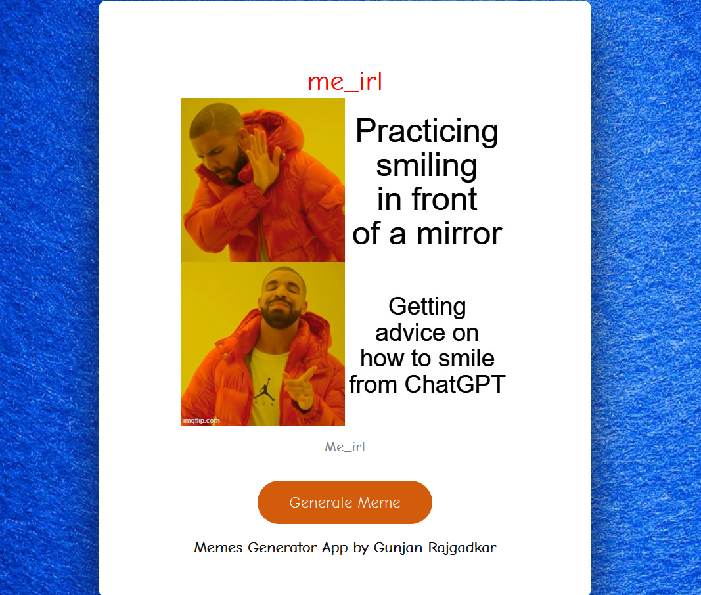

# 🎉 Meme Generator App 🎉

Welcome to the **Meme Generator App** – your ultimate source for fresh, hilarious memes from Reddit! Pulling from some of the funniest meme subreddits, this app keeps you entertained with trending content, all in one place. Built with **HTML**, **CSS**, and **JavaScript**, this lightweight app is simple and enjoyable to use!

---

## 📸 App Preview



> _Preview of the app in action, showing a sample meme fetched from Reddit._

---

## 🛠 Features

✨ **Fresh Memes:** Pulls the latest memes from popular Reddit subreddits  
🔄 **One-click Refresh:** New memes at the click of a button  
🎨 **User-Friendly UI:** Simple, clean design for a smooth meme browsing experience  

---

## 🚀 Getting Started

1. **Clone this repository**:
   ```bash
   git clone https://github.com/gunjanrajgadkar/Memes-Generator-App.git

Open index.html in your preferred browser to get started.

Note: Make sure you're connected to the internet to fetch data from Reddit!

---

## 📝 Usage

    Open the app.
    Select a subreddit from the list.
    Click on the "Get Meme" button and enjoy!
    Repeat steps 2 and 3 to fetch endless laughs!

---

## 📑 List of Subreddits

The app fetches memes from the following popular subreddits:

- 🔥 r/memes
- 😆 r/dankmemes
- 🌸 r/wholesomememes
- 😂 r/funny
- 🐶 r/AdviceAnimals
- 👼 r/comedyheaven
- 🦸 r/raimimemes
- 🦸‍♂️ r/marvelmemes
- 💻 r/ProgrammerHumor

You can easily customize the list by adding more subreddits in the code.

---

## 👤 Author

    Name: Gunjan Rajgadkar
    GitHub: @gunjanrajgadkar

---

## 🤝 Contributing

Contributions are welcome! If you have ideas for improvement or bug fixes, feel free to open an issue or submit a pull request.

---

## 📄 License

This project is licensed under the MIT License.

---

## 🌐 Live Demo

    Coming soon!

---

## 🔗 Additional Links

    Contact Me: @gunjanrajgadkar

---


Enjoy endless laughs with the Meme Generator App! Keep the meme culture alive and share the joy. 🎉😂

---